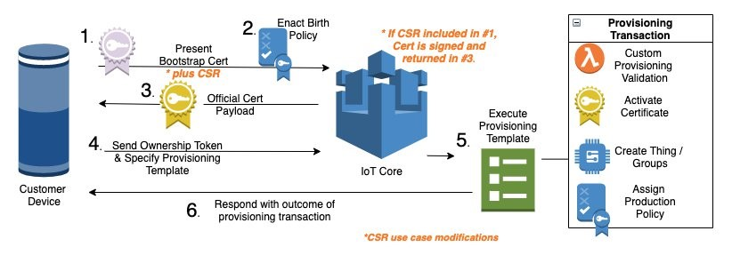

<!-- Copyright Amazon.com, Inc. or its affiliates. All Rights Reserved. -->
<!-- SPDX-License-Identifier: MIT-0 -->

# Automated IoT Fleet Provisioning By Claim using Bootstrap Certificates
AWS IoT Core Fleet Provisioning provides all necessary tools to securely onboard IoT devices. This process includes establishing a unique identity for each device, registering each device within AWS IoT, and managing the device permissions. The image below is from [how-to-automate-onboarding-of-iot-devices-to-aws-iot-core-at-scale-with-fleet-provisioning](https://aws.amazon.com/blogs/iot/how-to-automate-onboarding-of-iot-devices-to-aws-iot-core-at-scale-with-fleet-provisioning/), which provides a detailed description of fleet provisioning. Provisioning by claim is a popular provisioning method that uses a bootstrap certificate (X.509 certificate and a private key) that can be included on edge devices during the manufacturing process. The edge device first connects to IoT Core using the bootstrap certificate to request production certificates that uniquely identify the device. At this point, the device uses the production certificates for future AWS IoT connections. For the first connection with the production certificates, IoT Core references a provisioning template to assign the correct permissions to the device. At this point, the device has full production permissions during communications with AWS IoT Core.




This repository includes AWS CloudFormation templates that fully automate the process of setting up fleet provisioning by claim. This removes the need to manually create and link AWS resources with the aim to provide a turnkey IoT device onboarding experience. This CloudFormation templates in this repo create: 

1. All cloud infrastructure for fleet provisioning by claim
2. A custom account-specific edge client that can be deployed on edge devices (prebaked with bootstrap certificates and your IoT endpoint)
3. (**New**): The ability to manage and rotate certificates signed by an AWS Root CA with configurable timelines and graceperiods.

## Getting Started

### Cloud Setup

These steps only need to be completed once per AWS account.

1. Clone this repository to code commit
2. Install AWS CLI
3. Use the following command to install infrastructure into your account

```
aws cloudformation create-stack --region PUT-REGION-HERE --stack-name PUT-STACK-NAME-HERE --template-body file://pipeline.yaml --capabilities CAPABILITY_NAMED_IAM --parameters ParameterKey=CodeRepositoryName,ParameterValue=PUT-REPO-NAME-HERE ParameterKey=CodeRepositoryBranch,ParameterValue=PUT-BRANCH-HERE ParameterKey=ResourceTag,ParameterValue=PUT-RESOURCE-TAG-HERE --profile PUT_PROFILE_HERE
```

Example

```
aws cloudformation create-stack --region us-east-1 --stack-name pipeline --template-body file://pipeline.yaml --capabilities CAPABILITY_NAMED_IAM --parameters ParameterKey=CodeRepositoryName,ParameterValue=fleet ParameterKey=CodeRepositoryBranch,ParameterValue=master ParameterKey=ResourceTag,ParameterValue=fleetprov --profile default
```

This template will dynamically create an edge client and bootstrap certificates for your account. These resources are uploaded to an Amazon S3 bucket named {ResourceTag}-{rootstackId}-bootstrapcerts-{stackId}. The full name of the S3 bucket as also provided as an output of the root stack.

Cloud updates should be performed by updating the AWS Serverless Application Modem (SAM) template.yaml file from this repository or files referenced by the template.yaml file. All updates pushed to AWS CodeCommit will be built and deployed as CloudFormation templates. Pipeline.yaml creates a pipeline using CodeCommit, AWS CodeBuild, and AWS CodeDeploy. After deployment, updates to template.yaml and resources referenced by template.yaml in this CodeCommit repository will push updates to AWS infrastructure via CloudFormation. All template.yaml files in this repository are SAM templates. Codebuild uses instructions in the buildspec.yaml file to transform the SAM templates in this repository to CloudFormation templates for deployment. 

### Edge Setup

Completing the cloud setup dynamically creates an edge client for your account in the S3 bucket at {ResourceTag}-{rootstackId}-bootstrapcerts-{stackId}. This mqtt client was adapted from https://github.com/aws-samples/aws-iot-fleet-provisioning and is provided in the /Client folder at the root level of the repo for your reference and for future code changes. Note that the following steps require using the personalized edge client that is uploaded to the S3 folder (client.zip) and not the general client files in the repo itself. For device setup, complete the following steps on each edge device. 

1. Install Python 3.7 or above
2. Copy client.zip from the S3 bucket to the edge device and unzip.
3. Open machine_config.json and set the "serial_num" value to a unique identifier for the device. This will be used as the thing name.
4. Navigate your command prompt to the Client directory
5. Install python requirements ```pip3 install -r requirements.txt```
6. Run program ```python main.py```

The client exchanges the bootstrap certificates for the production certificates with extended permissions. These certificates are then used for all future mqtt communication on topics containing the unique name assigned to this device (described in detail in fleet-provisioning components).

### NEW! Cert Rotation 
All things created in the AWS IoT registry will contain a *cert_issuance* attribute which will be the trigger for detecting certificates outside of the expiry date. A lambda trigger will run daily to detect expired certs and publish a message to each endpoint within the graceperiod of expiry. Your edge device must subscribe to this message and handle the published alert (arriving each day until compliance is met or certificate expires altogether). By executing the provided *run_provisioning* method (in main.py) and passing in run_provisioning(isRotation=True), the edge will perform a new cert rotation. The provisioning hook will validate if the cert_issuance date is indeed out of compliance and if so, issue a new certificate with an updated date (deactivating the old). The following illustrates a sample test workflow:

1) Make sure to enable Fleet Index Settings (Thing Indexing) in IoT Core / Settings.
2) Execute main.py from the edge to issue your initial production certs (from the bootstrap certs)
3) From IoT Core, select Manage and click on your newly created thing, and modify the cert issuance date e.g. (20180630). yyyymmdd
4) In IoT Core, Go to the Test console and subscribe to all topics (#). Note the published message to the device to rotate.
5) Back at the edge, modify the run_provisioning method by passing in (True) and re-run.
6) Observe the swap in certificates, and the new date and cert association for the THING in IoTCore.

## Fleet-Provisioning Resources

### IoT Cloud Resources
The cloud provisioning resources (1-4 below) are created with an AWS Lambda custom resource in CloudFormation SubTemplates\IoT\Lambdas\provision_device\app.py. These assets for fleet provisioning include bootstrap certificates, a provisioning template, production certificates, and a Lambda provisioning hook. 

1. Bootstrap Certificates: Certificates used with all edge devices that provide limited permissions policy shown below. The bootstrap policy allows the device to connect to the iot endpoint and publish/subsribe to topics to request production certificates via the provisioning template. 

```
{
    "Version": "2012-10-17",
    "Statement": [
        {
            "Effect": "Allow",
            "Action": [
                "iot:Connect"
            ],
            "Resource": [
                "*"
            ]
        },
        {
            "Effect": "Allow",
            "Action": [
                "iot:Publish",
                "iot:Receive"
            ],
            "Resource": [
                "arn:aws:iot:$REGION:$ACCOUNT:topic/$aws/certificates/create/*",
                "arn:aws:iot:$REGION:$ACCOUNT:topic/$aws/provisioning-templates/$PROVTEMPLATE/provision/*"
            ]
        },
        {
            "Effect": "Allow",
            "Action": [
                "iot:Subscribe"
            ],
            "Resource": [
                "arn:aws:iot:$REGION:$ACCOUNT:topicfilter/$aws/certificates/create/*",
                "arn:aws:iot:$REGION:$ACCOUNT:topicfilter/$aws/provisioning-templates/$PROVTEMPLATE/provision/*"
            ]
        }
    ]
}
```

2. Provisioning Template: Device onboarding asset that defines parameters required for production certificate request and defines production policy permissions. Production policy is provided in 3.

```
{
    "Parameters": {
        "SerialNumber": {
            "Type": "String"
        },
        "ModelType": {
            "Type": "String"
        },
        "AWS::IoT::Certificate::Id": {
            "Type": "String"
        }
    },
    "Resources": {
        "certificate": {
            "Properties": {
                "CertificateId": {
                    "Ref": "AWS::IoT::Certificate::Id"
                },
                "Status": "Active"
            },
            "Type": "AWS::IoT::Certificate"
        },
        "policy": {
            "Properties": {
                "PolicyDocument": ""
            },
            "Type": "AWS::IoT::Policy"
        },
        "thing": {
            "OverrideSettings": {
                "AttributePayload": "MERGE",
                "ThingGroups": "DO_NOTHING",
                "ThingTypeName": "REPLACE"
            },
            "Properties": {
                "AttributePayload": {
                    "model_type": {
                        "Ref": "ModelType"
                    }
                },
                "ThingGroups": [],
                "ThingName": {
                    "Ref": "SerialNumber"
                }
            },
            "Type": "AWS::IoT::Thing"
        }
    }
}
```  

3. Production Certificates: The production certificates receive permissions based on the production policy. This policy grants full publish and subscribe permissions for topic containing device name. 

```
{
    "Version": "2012-10-17",
    "Statement": [
        {
            "Effect": "Allow",
            "Action": [
                "iot:Connect"
            ],
            "Resource": [
                "arn:aws:iot:$REGION:$ACCOUNT:client/${iot:Connection.Thing.ThingName}"
            ]
        },
        {
            "Effect": "Allow",
            "Action": [
                "iot:Publish"
            ],
            "Resource": [
                "arn:aws:iot:$REGION:$ACCOUNT:topic/*/${iot:Connection.Thing.ThingName}/*"
            ]
        },
        {
            "Effect": "Allow",
            "Action": [
                "iot:Subscribe"
            ],
            "Resource": [
                "arn:aws:iot:$REGION:$ACCOUNT:topicfilter/*/${iot:Connection.Thing.ThingName}/*"
            ]
        },
        {
            "Effect": "Allow",
            "Action": [
                "iot:Receive"
            ],
            "Resource": "arn:aws:iot:$REGION:$ACCOUNT:topic/*/${iot:Connection.Thing.ThingName}/*"
        }
    ]
}
```

4. Lambda Provisioning Hook: Lambda function with custom logic to evaluate if a device should receive the production policy permissions. This function can be used for tasks such as whitelisting devices based on serial number.


### Lambda Functions

1. DeviceProvisioningFunction: 
Location: SubTemplates\IoT\Lambdas\provision_device\app.py  
Trigger: Template creation  
Actions:  
    - Create bootstrap policy  
    - Create bootstrap certificates  
    - Save bootstrap certs to S3  
    - Create provisioning template  
    - Create edge personalized client for your AWS account

2. DeviceProvisioningHookFunction:  
Location: SubTemplates\IoT\Lambdas\provision_hook\app.py  
Trigger: Fleet-provisioning client publish to topic  
Actions:  
    - Logic to approve/deny device certificate requests


### Edge Client

The edge client was adapted from https://github.com/aws-samples/aws-iot-fleet-provisioning.

Edge Client: Python application with bootstrap certificates that runs on the edge device. The app establishes mqtt communication and exchanges the bootstrap certificates for the production certificates with elevated privileges.   


### Infrastructure Teardown
Teardown removes all SSM managed instances and IoT things/resources created using the edge client  

1. Delete the CloudFormation root project assets stack {ResourceTag}
2. Delete the CloudFormation pipeline stack
3. Delete things created for project
4. Delete production policy for project
5. Delete production policy certificate for project